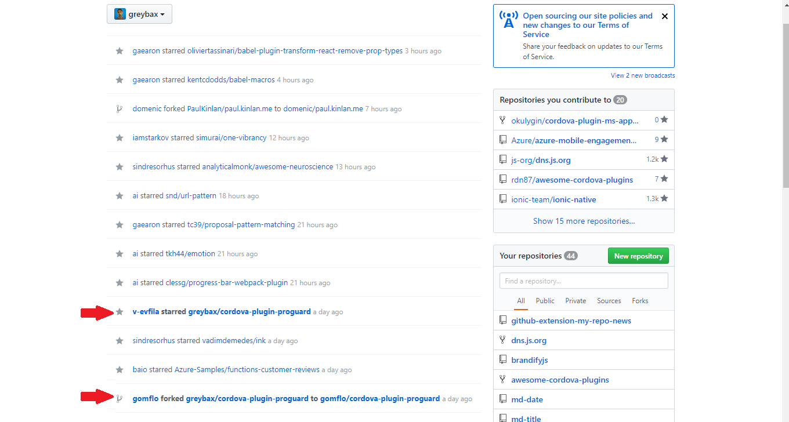

# github-extension-my-repo-news

> Chrome extension which helps you not to miss important changes in your news thread related to your repo.

If you news thread updates pretty often, but you would like don't miss any actions with your repos so this extension for you. Just install it from [Chrome Store](https://chrome.google.com/webstore/detail/my-git-repo-news/bpijgihicffjpcnjndpcdicohomlfbhp)

**Before:**
;

**After:**
;

## License

MIT © [Aleksandr Filatov](https://alfilatov.com)